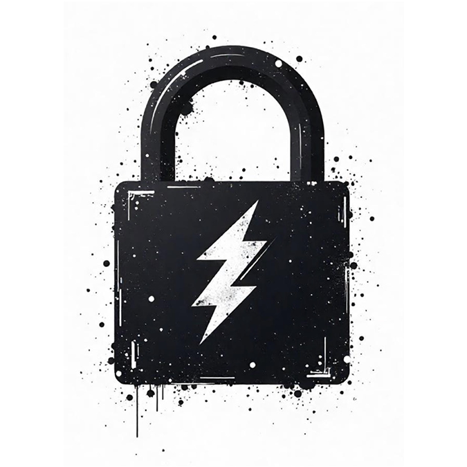

# Pika PKI

Pika PKI is a PKI management Text User Interface (TUI).  It's built using [gum](https://github.com/charmbracelet/gum?tab=readme-ov-file), which is a dependency.

<table style="border:none"><tbody><tr><td style="border:none"><center></center></td><td style="border:none">

- Create and manage multiple Root Certificate Authorities and their chains
- Define your PKI Chain however you want with Intermediate CAs and Signing CAs
- Sign certificates anywhere along the chain
- Built on standard OpenSSL commands and configurations
- Easily create certificates bundles for HAProxy, OpenShift, and more

</td></tr></tbody></table>

## Dependencies

- [Gum](https://github.com/charmbracelet/gum)
- OpenSSL
- ncurses
- grep
- sed
- tree

Or, just Docker/Podman.

## Getting Started

### The Old Fashioned Way

1. [Install gum](https://github.com/charmbracelet/gum?tab=readme-ov-file#installation) and above other dependencies.
2. Clone this repo `git clone https://github.com/kenmoini/pika-pki`
3. Enter the directory `cd pika-pki`
4. Run `./pika-pki`
5. ???????
6. ***PROFIT!!!!!!1***

### The Cloud Native Containers-for-everything Way

```bash
# Create a directory to store the PKI assets
mkdir pika-pki

# Run the container???
podman run --rm -it -v ./pika-pki:/data:Z quay.io/kenmoini/pika-pki:latest
```

## Concepts

- You can create and manage any number of **Root Certificate Authorities**
- There can be **any number of Intermediate CAs** under a Root CA or other Intermediate CAs
- **Signing CAs denote the last CA in the chain** - it cannot sign Certificates for a subordinate CA
- Any CA along the chain can sign Certificates of any sort, but it's best to leave that to a Signing CA at the end of the chain
- The Workspace directory stores all the assets for the PKI - in that directory structure you will find a `public_bundles` folder with a set of subdirectories called `certs` and `crls`.  This is where public Certificates like CA Certificates and CRLs will be stored.  You should be able to copy or symlink the path to where a web server can host those assets.
- There is another directory called `private_bundles` in the Workspace directory - this is meant as an easily accessible place to store your Saved Certificates.

## Usage

- **Launch** the Pika PKI Text User Interface (TUI)
- You will be prompted to **create a Root Certificate Authority** for new workspaces
- While you could start creating Certificates and signing them with the Root CA, it's ideal to create an Intermediate CA, or at least a Signing CA.  **Create an Intermediate CA under the Root CA**.
- Continue to **create a Signing CA under the Intermediate CA**.
- **Create a new Certificate**, type of Server - give it any FQDN you want.
- With a new Certificate created you can do a number of different things:
  - **Save** the Certificate & Key to a path
  - **Recreate** the Certificate - create a new key, CSR, and Certificate while revoking/deleting the old one
  - **Rotate** the Certificate - request a new signed Certificate with the existing CSR
  - **Revoke** the Certificate (if the CA has a CRL)
  - **Delete** the Certificate (if the CA does not have a CRL)

Additional Advanced Usage options are available as detailed below.

## Optional Parameters

To override some default behavior you can override some parameters via Environmental Variables.

| Variable | Default | Note |
|----------|---------|------|
| PIKA_PKI_DIR | `$(pwd)/.pika-pki` | Workspace directory - where PKI assets are stored |
| PIKA_PKI_DEFAULT_ORG | `""` | Will provide a default answer for the questions asking for an Organization |
| PIKA_PKI_DEFAULT_ORGUNIT | `""` | Will provide a default answer for the questions asking for an Organization Unit |
| PIKA_PKI_DEFAULT_COUNTRY | `""` | Will provide a default answer for the questions asking for a Country |
| PIKA_PKI_DEFAULT_STATE | `""` | Will provide a default answer for the questions asking for a State |
| PIKA_PKI_DEFAULT_LOCALITY | `""` | Will provide a default answer for the questions asking for a Locaity  |
| PIKA_PKI_DEFAULT_EMAIL | `""` | Will provide a default answer for the questions asking for an email address |
| PIKA_PKI_DEFAULT_CRL_URI_BASE | `""` | Will provide a default answer for the questions asking for a base URI for hosted CRLs |
| PIKA_PKI_CERT_KEY_ENCRYPTION | `"false"` | By default non-CA leaf certificates do not encrypt their private keys - set to `true` to password encrypt certificate keys |

An example of using these environmental variables to make PKI creation simple with default answers would be something like this:

```bash
# Do this once per shell terminal
export PIKA_PKI_DEFAULT_ORG="Kemo Labs"
export PIKA_PKI_DEFAULT_ORGUNIT="InfoSec"
export PIKA_PKI_DEFAULT_COUNTRY="US"
export PIKA_PKI_DEFAULT_STATE="North Carolina"
export PIKA_PKI_DEFAULT_LOCALITY="Raleigh"
export PIKA_PKI_DEFAULT_EMAIL="ken@Kenmoini.com"
export PIKA_PKI_DEFAULT_CRL_URI_BASE="https://pki.kemo.network/crls"

# Now run Pika PKI
./pika-pki.sh
```

## Advanced Usage

### Copying Public Bundle Assets

When serving your PKI, you'll often need to distribute things such as CA Certificates and CRLs.  After starting Pika PKI, there will be a few directories created - one being `public_bundles/{certs,crls}`.

By starting Pika PKI with `./pika-pki.sh -m copyBundles`, the application will copy the public bundles of all managed Certificate Authorities to that directory which can then be served easily with a web server of choice.  Public bundles include things such as each Certificate Authority's Certificate, CA Chain - with and without root in a full-chain - and Certificate Revocation List (CRL).

Whenever rotating a CRL, the public bundle of that CRL's CA will also be freshly copied to update the CRL file.

The file format when copied is `${CA_TYPE}-ca.{$CA_CN_SLUG}.{cert.pem|crl}` where `$CA_TYPE` can be `root`, `intermediate`, or `signing`.

The value for `$CA_CN_SLUG` comes from a "slugified" (alpha-num only, space/other characters replaced with a dash) value of the Certificate Authority's Common Name.  This value is also represented in the CA's folder name along the path, eg `kemo-intermediate-ca` in `roots/kemo-root-ca/intermediate-ca/kemo-intermediate-ca`.

The generation of these Public Bundle assets means you can serve them from a web server for easy distribution of your PKI chain and CRLs.  An example of this would be with something like with Podman to serve it via an Nginx server:

```bash
# Start the nginx container
podman run -it --rm -d -p 8085:80 \
 -v .pika-pki/public_bundles:/usr/share/nginx/html/pki-pub:Z \
 docker.io/nginx

# or - Start the nginx container with directory listeing enabled

echo 'server {listen 80; server_name localhost; location / { root /usr/share/nginx/html; index index.html index.htm; autoindex on; autoindex_exact_size off; }}' > nginx-default.conf

podman run -it --rm -d -p 8085:80 \
 -v .pika-pki/public_bundles:/usr/share/nginx/html/pki-pub:Z \
 -v ./nginx-default.conf:/etc/nginx/conf.d/default.conf:Z \
 docker.io/nginx
```

Once you run that command you can access your Public Bundle files from `http://localhost:8085/pki-pub/`.  You could easily place this behind a reverse proxy and modify the access and routing.

### Certificate Revocation Lists (CRL)

When creating a Certificate Authority, you will be prompted for an optional parameter, "CRL URI Root".  This is the base path where the CRL will be served for clients to query revoked certificates.

You should provide the base URI to where a public server is available - eg if you provide `https://ca.example.com/public` then the CRL will be configured and presented as `https://ca.example.com/public/crls/root-ca.my-root-ca.crl`.

The format is `${URI_ROOT}/pki-pub/crls/${CA_TYPE}-ca.${CA_CN_SLUG}.crl` where `$CA_TYPE` can be `root`, `intermediate`, or `signing`.

The value for `$CA_CN_SLUG` comes from a "slugified" (alpha-num only, space/other characters replaced with a dash) value of the Certificate Authority's Common Name.  This value is also represented in the CA's folder name along the path, eg `kemo-signing-ca` in `roots/kemo-root-ca/intermediate-ca/kemo-intermediate-ca/signing-ca/kemo-signing-ca`.

If you'd like the CRL to be hosted on a different path, then modify the default OpenSSL Configuration - see below for instructions on that.

### Rotating/Renewing Certificate Revocation Lists

By default a Certificate Authority is configured for a 30 day long CRL, which can be changed in the OpenSSL configuration with an override detailed below, or after the CA is created by modifying the `openssl.cnf` file in the CA directory.

This should be rotated regularly before whatever that expiration is.

To do so easily, you can execute `./pika-pki.sh -m rotateCRL -a path/to/ca -p passwordOrPathToPasswordFile`.

The `-m rotateCRL` option will process a CRL rotation/renewal - this is done on a per-CA basis by specifying `-a path/to/ca` eg `-a .pika-pki/roots/kemo-root/intermediate-ca/kemo-intermediate`.

Since the CRLs have to be signed by the CA Private Key, the password is needed to be provided - do this with `-p passwordOrPathToPasswordFile` which, can either be the password plain text, or a path to a file with the password in it.

### Overriding OpenSSL Configuration

The default configuration can be found in `functions/config.sh`.  There is some logic and templating involved which is why it is embedded in a Bash script.

To override these defaults, create a folder called `overrides` in this directory, copy the `functions/config.sh` file into it, and modify as needed.

## TODO

- Add cool screen recording GIFs
- Add CA Operational Commands to menu
